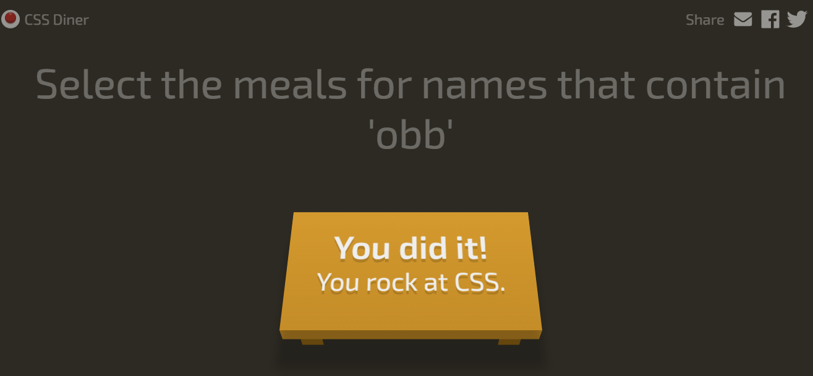

## What I learned This Week.
## Tuesday class- There has been no class (snow day).

- We need to have a good amount of work of mini project 1 for the end of this week. 

- The box model, its the content itself, the padding, the border and the margin.

- The computed is the final thing to define the size of the element. 

- If you add !important to a css rule it will overide all other rules. 

- We use css styles because it is more efficient in terms of access and update, and you can have a lot of different pages that use the same css file. 

- 
 is a box that holds stuff, you can use it to group sections, create cards, or organize layout. 

-  is a small inline highlighter and it is used to style or highlight just a word or phrase, without breaking the line. 

- Block elements stack vertically, take full width:

, 
, <h1>, <ul>, <li>, <section>
Inline elements flow side by side, like words in a sentence:
, <a>, <strong>, 

- Pseudo-classes: Interactive Styles.Makes the code much more readabole.  

+ a:hover is used to change the colour when you put your mouse over it. Its a special effect on some of the elements. 

- Css Transitions can be made using Java Script, with simple css it also lets you... the exaple of class is the button and the animation of colour changing to red when you hover over it. 
 
## What do i need to do for next week?
- Try to find good effects.
- Mini project 1.

## Code i am proud of: Game. 

- I am proud of finishing it although i used ai when it got ver complicated. Its in the image folder just in case you cant open it here. 

## Challenges I faced
- I struggles to understand the new tags and how to use them.
- I also struggled to understand the box model and how to use it.